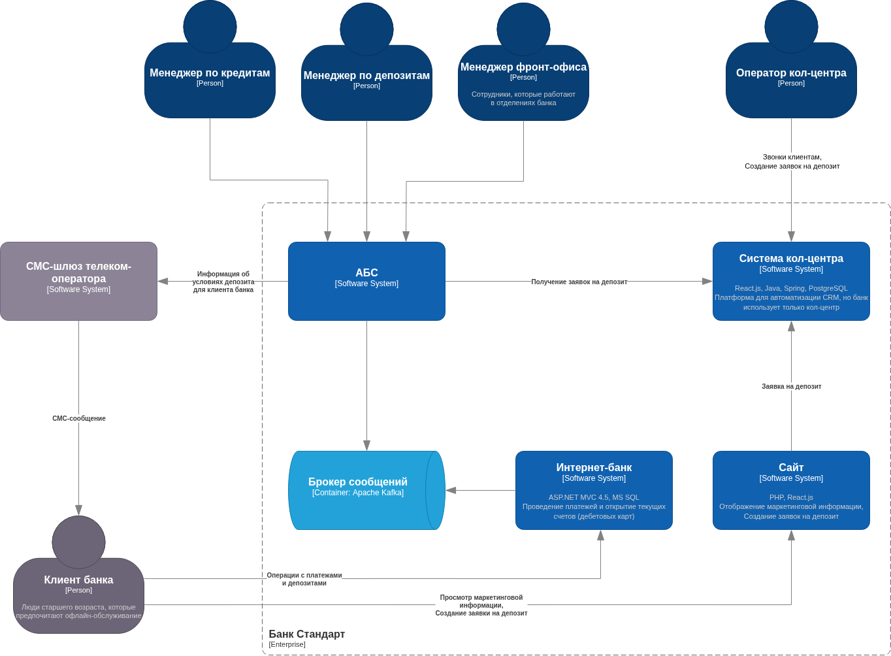
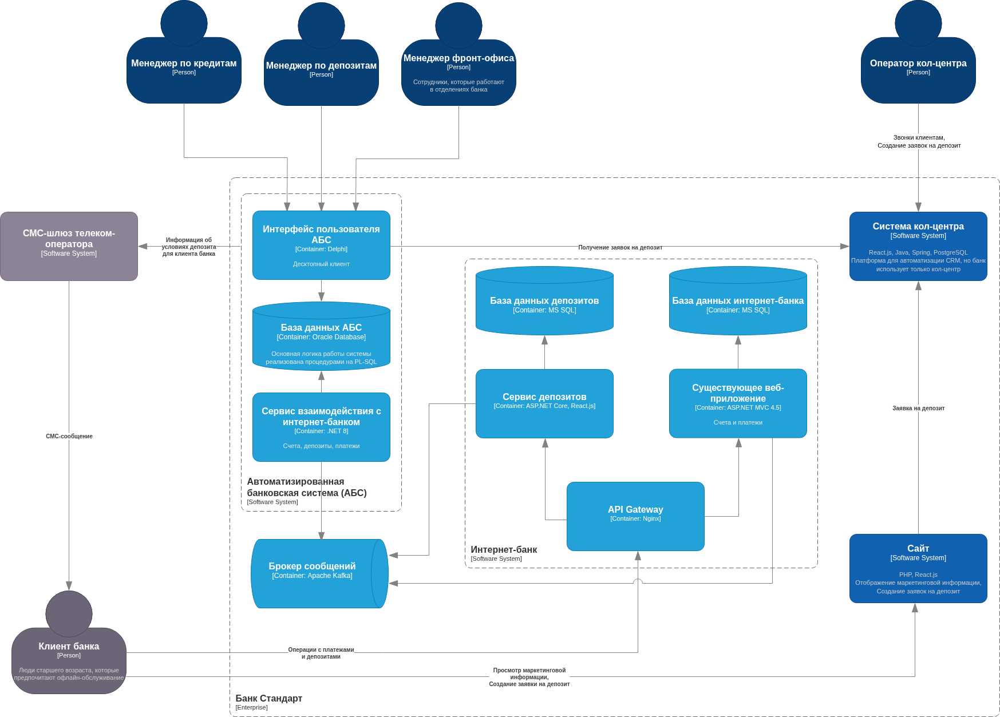

### **Название задачи:** MVP открытия депозитов онлайн
### **Автор:** Дмитрий Баргатин
### **Дата:** 19.07.2025
### **Функциональные требования**

| **№** | **Действующие лица или системы** | **Use Case**                      | **Описание**                                                                                                                                     |
| :---: | :------------------------------- | :-------------------------------- | :----------------------------------------------------------------------------------------------------------------------------------------------- |
|  UC1  | Клиент, Веб-сайт                 | Просмотр депозитных предложений   | 1. Клиент заходит на сайт 2. Ознакамливается с доступными депозитами и ставками 3. Оставляет заявку на открытие депозита                   |
|  UC2  | Клиент, Веб-сайт, Кол-центр      | Создание заявки на депозит        | 1. Клиент заполняет форму (ФИО, телефон) 2. Отправляет заявку 3. Данные шифруются и передаются в систему 4. Подтверждение через SMS-код |
|  UC3  | Клиент, Интернет-банк            | Просмотр текущих депозитов        | 1. Авторизация в интернет-банке 2. Просмотр списка активных депозитов 3. Детализация по каждому депозиту                                   |
|  UC4  | Клиент, Бэк-офис, Интернет-банк  | Получение персональных ставок     | 1. Бэк-офис формирует индивидуальные условия 2. Ставки загружаются в систему 3. Клиент видит персональные предложения в интернет-банке     |
|  UC5  | SMS-шлюз, АБС, Бэк-офис          | Информирование клиента            | 1. Бэк-офис подтверждает условия в АБС 2. Данные передаются в SMS-шлюз 3. Клиент получает уведомление об условиях и открытии депозита      |
|  UC6  | Кол-центр, Бэк-офис              | Обработка входящих заявок         | 1. Прием заявки от клиента 2. Создание задачи в системе для бэк-офиса 3. Расчет условий и открытие депозита сотрудником                    |
|  UC7  | Фронт-офис, АБС                  | Идентификация клиента             | 1. Сотрудник проверяет личность клиента 2. Активирует доступ к интернет-банку 3. Клиент получает возможность открывать депозиты онлайн     |
|  UC8  | Бэк-офис, АБС                    | Управление персональными ставками | 1. Авторизация в админ-панели 2. Просмотр списка клиентов и их условий 3. Корректировка индивидуальных ставок                              |
### **Нефункциональные требования**

|  №  | Категория требования | Формулировка требования                                 | Детализация                                                           |
| :-: | :------------------- | ------------------------------------------------------- | --------------------------------------------------------------------- |
|  1  | Надежность           | Обеспечить доступность системы на уровне 99.9% SLA      | Круглосуточная работа с допустимым простоем не более 8.76 часов в год |
|  2  | Масштабируемость     | Реализовать возможность горизонтального масштабирования | Добавление серверных мощностей без изменения архитектуры              |
|  3  | Производительность   | Гарантировать время отклика системы не более 1 с        | Для всех критичных пользовательских операций                          |
|  4  | Отказоустойчивость   | Обеспечить резервирование всех новых сервисов           | Реализация дублирующих компонентов для защиты от сбоев                |
|  5  | Архитектура          | Применить микросервисный подход при разработке          | Разделение функционала на независимые сервисы                         |
|  9  | Совместимость        | Обеспечить интеграцию с унаследованными системами       | Поддержка существующих протоколов и форматов данных                   |
| 10  | Технологический стек | Использовать уже освоенные командой технологии          | Минимизация обучения за счет применения проверенных решений           |
### **Решение**
#### Диаграмма контекста

#### Диаграмма контейнеров

