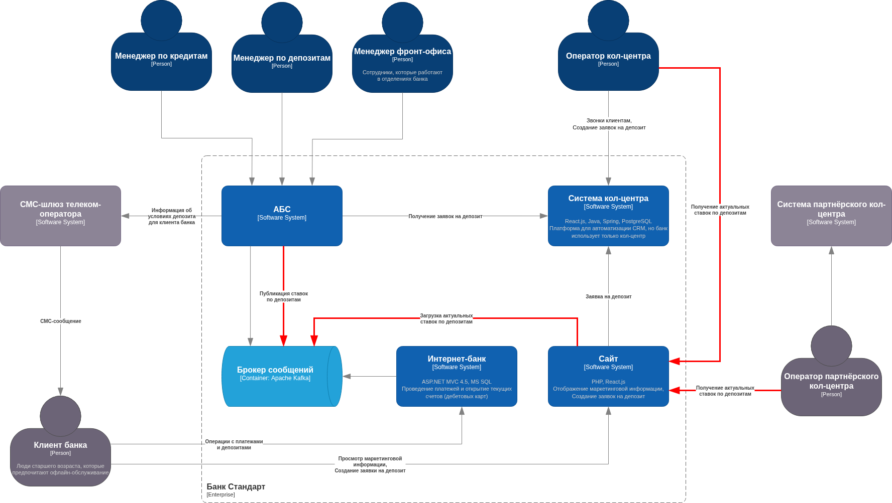
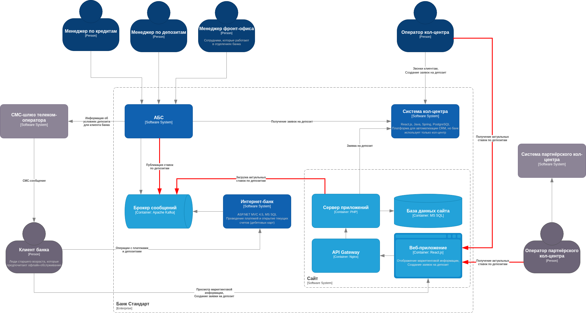

### **Название задачи:** Передача ставок по депозитам в кол-центр и партнёрский кол-центр
### **Автор:** Дмитрий Баргатин
### **Дата:** 19.07.2025
### **Функциональные требования**

| **№** | **Действующие лица или системы**                   | **Use Case**                                  | **Описание**                                                                                                                                                                              |
| :---: | :------------------------------------------------- | :-------------------------------------------- | :---------------------------------------------------------------------------------------------------------------------------------------------------------------------------------------- |
|  UC1  | Менеджер по депозитам, АБС, Брокер сообщений, Сайт | Публикация актуальных ставок по депозитам     | 1. Менеджер по депозитам актуализирует ставки по депозитам в АБС 2. АБС публикует ставки в специальном топике Брокера сообщений 3. Сайт получает ставки из Брокера и сохраняет в БД |
|  UC2  | Клиент, Оператор кол-центра, Сайт                  | Консультация клиента по текущим ставкам банка | 1. Клиент звонит в кол-центр и запрашивает информацию по депозитам 2. Оператор кол-центра уточняет ставки на Сайте 3. Оператор кол-центра сообщает информацию Клиенту               |
### **Нефункциональные требования**

| **№** | **Требование**                                                                           |
| :---: | :--------------------------------------------------------------------------------------- |
|   1   | Операторы кол-центров должны обладать максимально актуальной информацией о ставках банка |
### **Решение**

### **Альтернативы**

Передача информации об актуальны ставках посредством публикации XLS-файла на FTP-сервере.

**Недостатки, ограничения, риски**

1. Решение представленное на диаграммах сложнее и более трудоемко в реализации, чем предложенная альтернатива.

